## 视频自动添加字幕

### 1. 从视频中提取音频
使用MediaConvert 服务， 当视频文件转到s3中时， 调用lambda 进行音频提取

### 2. 从音频中生成文字
使用Transcript 服务， 当音频文件生成时， 调用lambda 生成srt 字幕文件

### 3. 对字幕文件和视频进行合并
使用MediaConvert 服务， 字幕文件生成后， 和原始视频进行合并。 


## 架构图
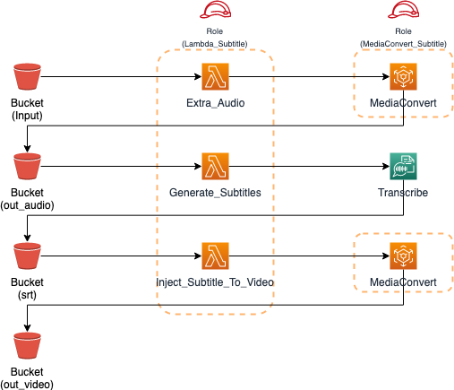
# Console 操作步骤
### 1. 创建S3存储桶
存储桶名称应为全球唯一，e.g subtitle.102030, 直接点击创建。在新创建的存储桶内创建以下文件夹。
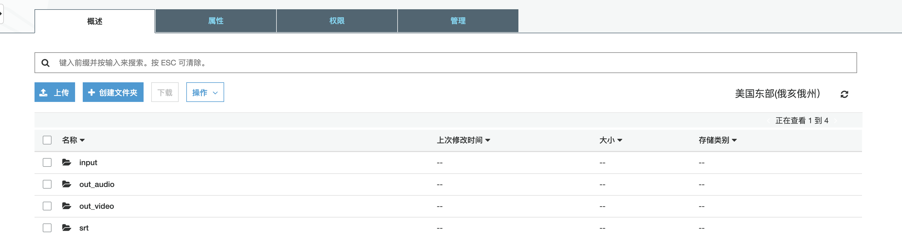
* input: 作为上传文件夹，保存视频源文件  
* out_audio: 音频输出文件夹  
* srt: 字幕文件  
* out_video: 合成后的视频文件夹

 

###  2. 创建相关Roles和权限  Lambda_Subtitle 和 MediaConvert_Subtitle
1. Lambda_Subtitle, 在IAM菜单里，选择创建角色，选择Lambda作为使用该角色的服务，选择下图所示的Permission Policies （权限偏大，真实场景应以最小权限为宜）
   主要用作lambda 执行s3 , Translate  Transcribe MediaConvert 等操作。
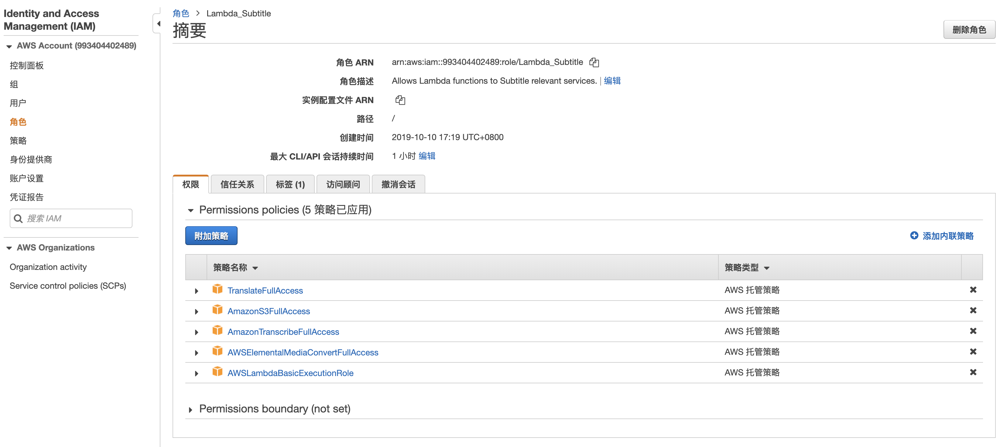

2. MediaConvert_Subtitle, 在IAM菜单里，选择创建角色，选择MediaConvert作为使用该角色的服务，选择下图所示的Permission Policies （权限偏大，真实场景应以最小权限为宜）
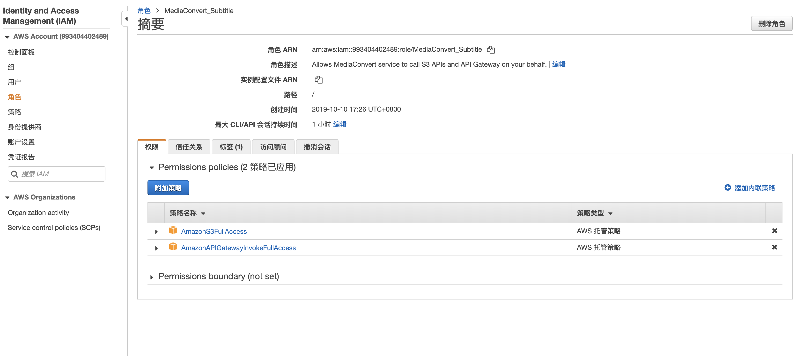

## 创建Lambda Functions

### 3. Extra_Audio
该Lambda 函数的作用， 主要是把视频文件转换成音频文件

1. 在Lambda菜单中选择创建函数，选择从头开始创作，函数名称：Extra_Audio，运行语言：Python 3.7，选择使用现有角色：Lambda_Subtitle，点击创建函数。
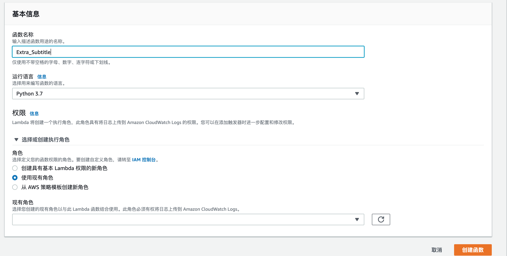

2. 修改 chinese_create_audio_media_convert.py 中的常量
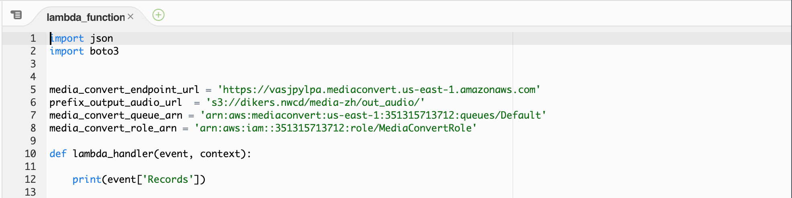

* media_convert_endpoint_url：在AWS Console的MediaConvert菜单中，点击账户找到
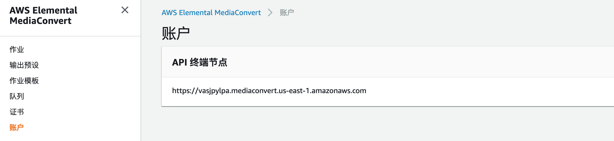
* prefix_output_audio_url： 's3://subtitle.102030/out_audio/' -- 存储桶名称为您刚创建的桶名称

* media_convert_queue_arn： 在AWS Console的MediaConvert菜单中，点击队列，点击Default队列找到
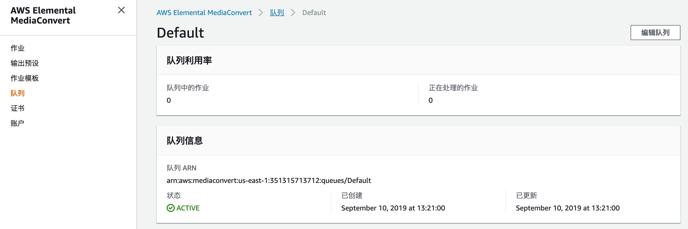

* media_convert_role_arn：在IAM菜单中找到角色MediaConvert_Subtitle，复制角色ARN

3. 复制chinese_create_audio_media_convert.py代码到刚创建的Extra_Subtitle的函数代码中，修改上面的内容， 并保存。
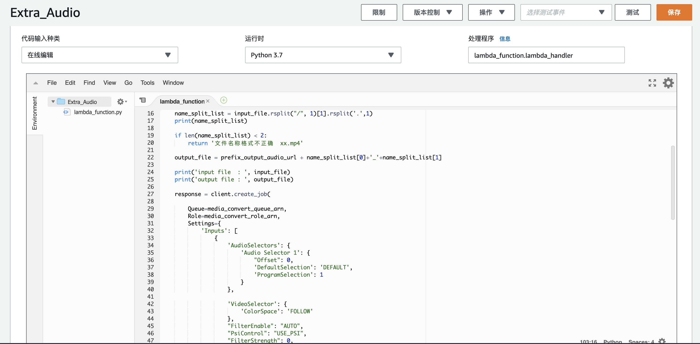
4. 点击[操作]，发布新版本。

5. 添加触发器
在lambda 中配置触发事件
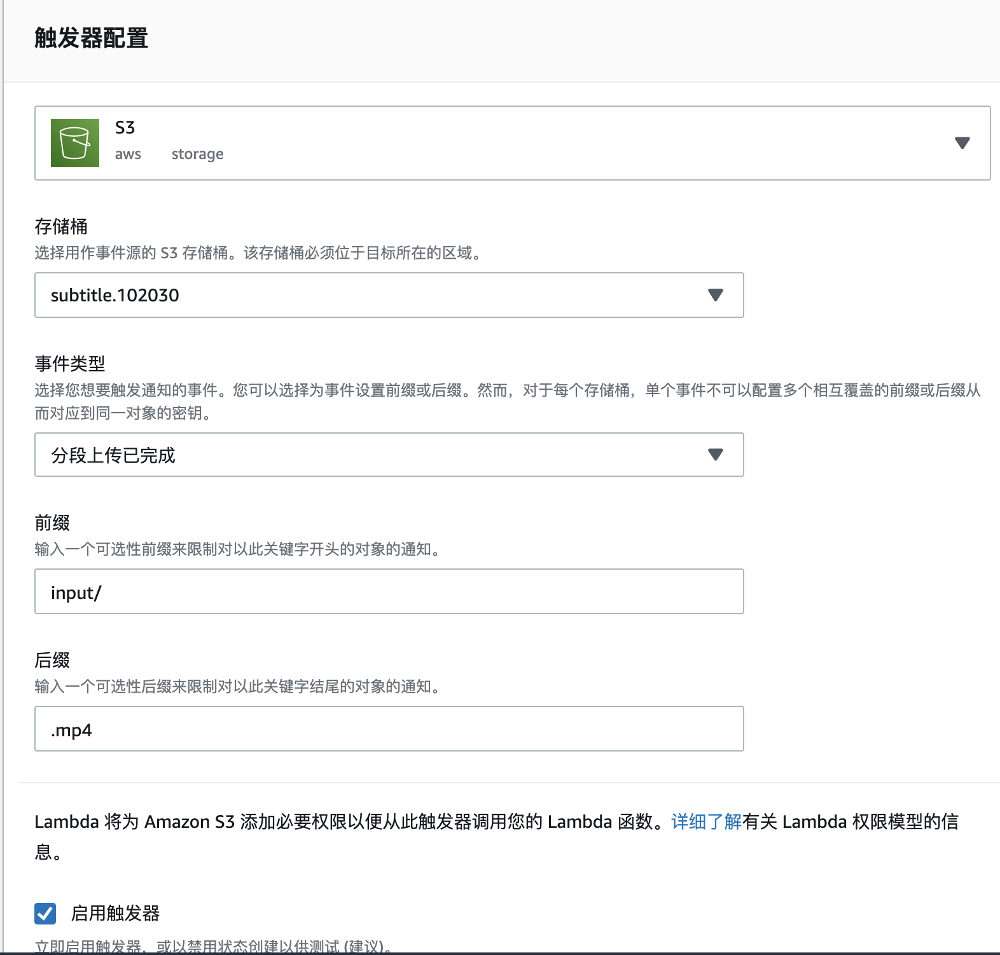

也可以在s3中配置触发事件
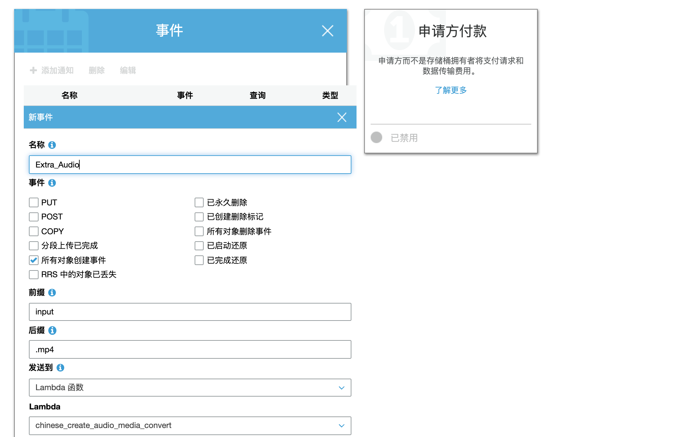


### 4. Generate_Subtitles
该函数是通过音频文件生成文本， 然后翻译成指定的语言， 

1. 在Lambda菜单中选择创建函数，选择从头开始创作，函数名称：Generate_Subtitles，运行语言：Python 3.7，选择使用现有角色：Lambda_Subtitle，点击创建函数。
2. 修改 chinese_create_str_by_audio.py
* bucket_name = 'subtitle.102030' -- 存储桶名称为您刚创建的桶名称

* srt_prefix = 'srt/'  字幕文件生成的路径

* target_region_name = 'us-east-1' -- region名称为您AWS console当前所操作的region

3. Lambda 函数执行时间需要调整成15分钟， 中间执行的任务比较多， 耗时长 。

4. 复制chinese_create_str_by_audio.py代码到刚创建的Generate_Subtitles的函数代码中，并保存。
5. 点击[操作]，发布新版本。
6. 添加触发器。

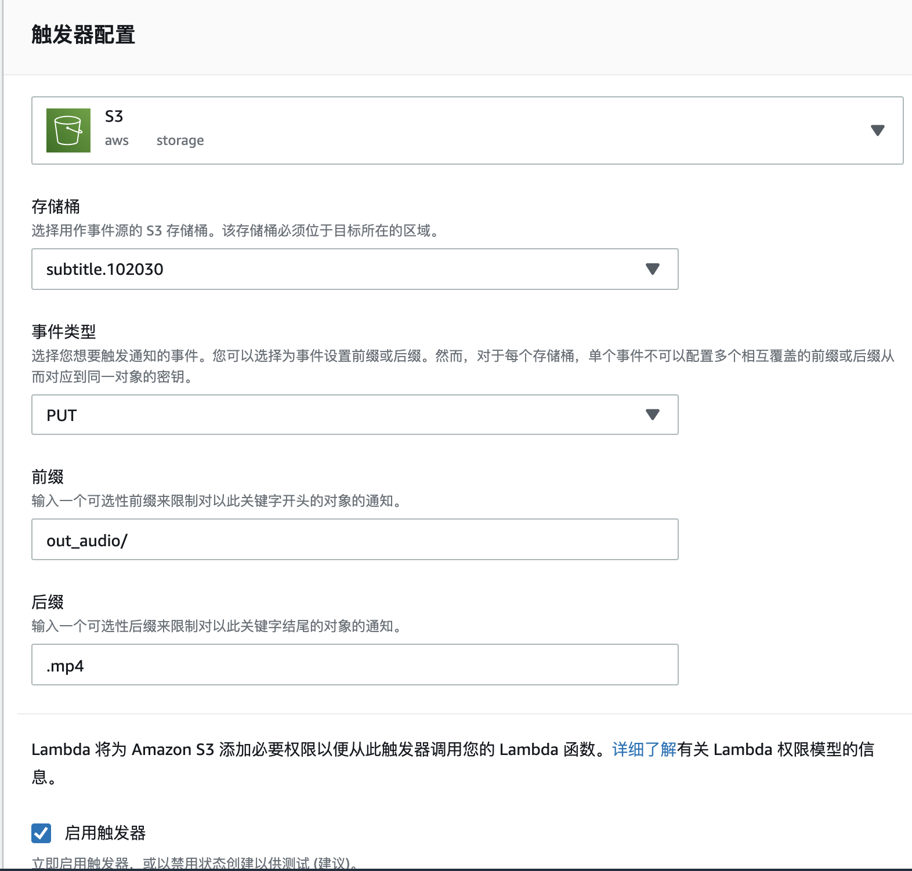

### 5. Inject_Subtitle_To_Video
1. 在Lambda菜单中选择创建函数，选择从头开始创作，函数名称：Inject_Subtitle_To_Video，运行语言：Python 3.7，选择使用现有角色：Lambda_Subtitle，点击创建函数。
2. 修改 chinese_create_merge_video_by_srt.py

* bucket_name = 'subtitle.102030' -- 存储桶名称为您刚创建的桶名称

* media_convert_endpoint_url：在AWS Console的MediaConvert菜单中，点击账户找到

* media_convert_queue_arn： 在AWS Console的MediaConvert菜单中，点击队列，点击Default找到

* media_convert_role_arn：在IAM菜单中找到角色MediaConvert_Subtitle，复制角色ARN

3. chinese_create_merge_video_by_srt.py代码到刚创建的Inject_Subtitle_To_Video的函数代码中，并保存。
4. 点击[操作]，发布新版本。
5. 添加触发器。
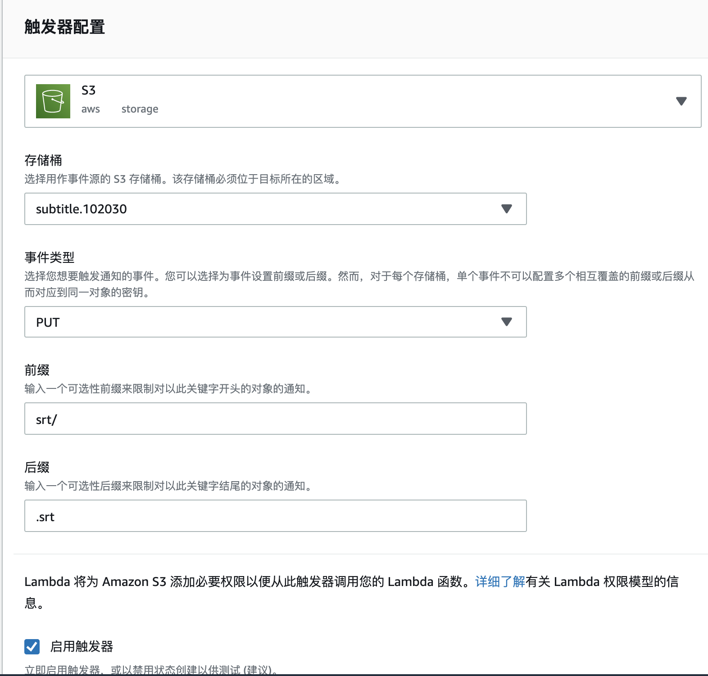


### 6. 测试


[测试视频下载 （汉语 普通话）](https://s3.amazonaws.com/dikers.nwcd/media-zh/test04.mp4)

可以将视频文件下载到本地， 测试中上传到指定的s3中
```
wget  https://s3.amazonaws.com/dikers.nwcd/media-zh/test04.mp4 

aws s3 cp test04.mp4 s3://subtitle.102030/input/test04.mp4

```

依次查看下面文件夹的输出

* out_audio 文件夹中会生成音频文件

* srt 文件夹中生成srt字幕文件

* out_video 文件夹中会生成合成的视频文件


