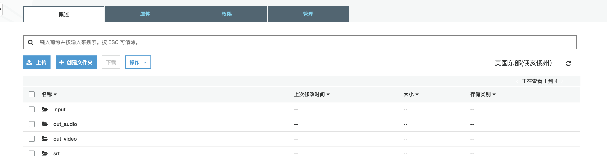
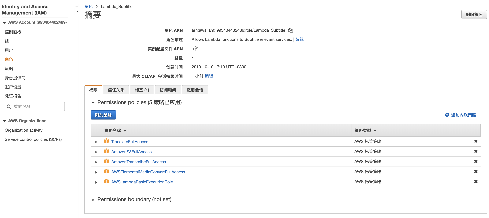
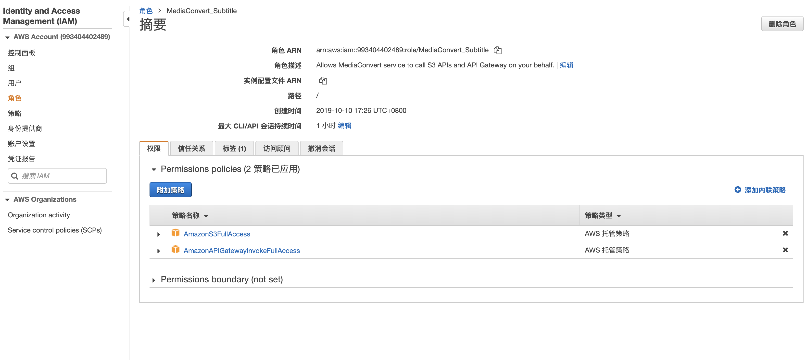
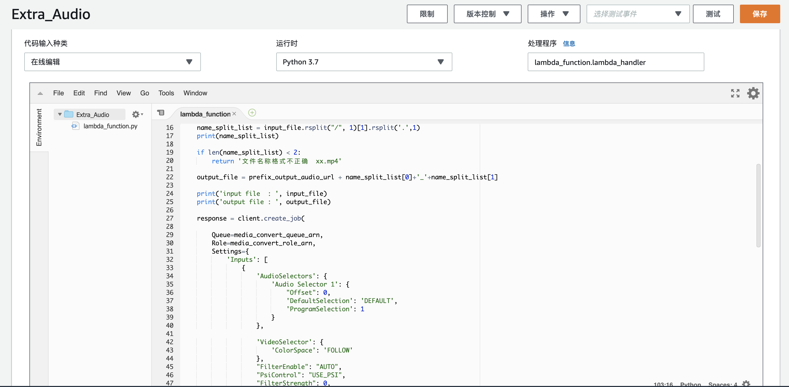

# 架构图

# Console 操作步骤
## 创建S3存储桶
存储桶名称应为全球唯一，e.g subtitle.102030，直接点击创建。在新创建的存储桶内创建以下文件夹。

input: 作为上传文件夹，保存视频源文件  
out_audio: 音频输出文件夹  
srt: 字幕文件  
out_video: 合成后的视频文件夹

## 创建Roles, Lambda_Subtitle 和 MediaConvert_Subtitle
1. Lambda_Subtitle, 在IAM菜单里，选择创建角色，选择Lambda作为使用该角色的服务，选择下图所示的Permission Policies （权限偏大，真实场景应以最小权限为宜）

2. MediaConvert_Subtitle, 在IAM菜单里，选择创建角色，选择MediaConvert作为使用该角色的服务，选择下图所示的Permission Policies （权限偏大，真实场景应以最小权限为宜）

## 创建Lambda Functions
### Extra_Audio
1. 在Lambda菜单中选择创建函数，选择从头开始创作，函数名称：Extra_Audio，运行语言：Python 3.7，选择使用现有角色：Lambda_Subtitle，点击创建函数。
2. 修改 chinese_create_audio_media_convert.py
media_convert_endpoint_url：在AWS Console的MediaConvert菜单中，点击账户找到
prefix_output_audio_url： 's3://subtitle.102030/out_audio/' -- 存储桶名称为您刚创建的桶名称
media_convert_queue_arn： 在AWS Console的MediaConvert菜单中，点击队列，点击Default找到
media_convert_role_arn：在IAM菜单中找到角色MediaConvert_Subtitle，复制角色ARN
3. 复制chinese_create_audio_media_convert.py代码到刚创建的Extra_Subtitle的函数代码中，并保存。

4. 点击[操作]，发布新版本。
5. 添加触发器。

### Generate_Subtitles
1. 在Lambda菜单中选择创建函数，选择从头开始创作，函数名称：Generate_Subtitles，运行语言：Python 3.7，选择使用现有角色：Lambda_Subtitle，点击创建函数。
2. 修改 chinese_create_str_by_audio.py
bucket_name = 'subtitle.102030' -- 存储桶名称为您刚创建的桶名称
srt_prefix = 'srt/'
target_region_name = 'us-east-1' -- region名称为您AWS console当前所操作的region

3. 复制chinese_create_str_by_audio.py代码到刚创建的Generate_Subtitles的函数代码中，并保存。
4. 点击[操作]，发布新版本。
5. 添加触发器。

### Inject_Subtitle_To_Video
1. 在Lambda菜单中选择创建函数，选择从头开始创作，函数名称：Inject_Subtitle_To_Video，运行语言：Python 3.7，选择使用现有角色：Lambda_Subtitle，点击创建函数。
2. 修改 chinese_create_merge_video_by_srt.py
bucket_name = 'subtitle.102030' -- 存储桶名称为您刚创建的桶名称
media_convert_endpoint_url：在AWS Console的MediaConvert菜单中，点击账户找到
media_convert_queue_arn： 在AWS Console的MediaConvert菜单中，点击队列，点击Default找到
media_convert_role_arn：在IAM菜单中找到角色MediaConvert_Subtitle，复制角色ARN

3. chinese_create_merge_video_by_srt.py代码到刚创建的Inject_Subtitle_To_Video的函数代码中，并保存。
4. 点击[操作]，发布新版本。
5. 添加触发器。

